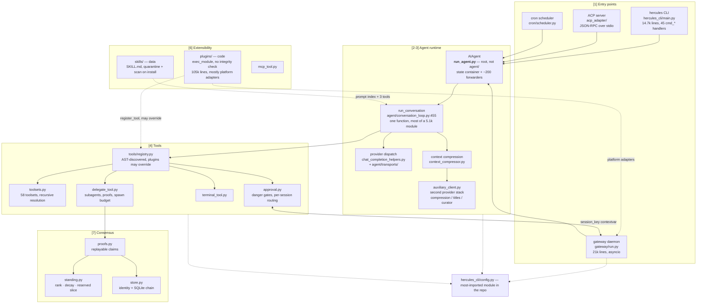

# CLAUDE.md

```
# ============================================================================
# HERCULES — SYSTEM BLUEPRINT
# ============================================================================
# Where things actually are, in the order a request moves through them.
#
#   [1/8] Entry points ......... how a turn starts
#   [2/8] Agent runtime ........ where the loop lives
#   [3/8] Provider dispatch .... how a request reaches a model
#   [4/8] Tools ................ what the model can call
#   [5/8] Delegation ........... subagents, proofs, budgets
#   [6/8] Extensibility ........ plugins (code) vs skills (data)
#   [7/8] Consensus ............ verified claims, standing
#   [8/8] Verification ......... how to run tests without lying to yourself
#
# Appendices: A. traps  B. security surfaces  C. half-finished  D. conventions
# ============================================================================
```

[`AGENTS.md`](./AGENTS.md) is the authority on *what to build* — design
philosophy and the contribution rubric. This file is *where things are*, and
is weighted toward the places the layout misleads you.

~500k lines of Python across nine packages. Every number below was verified
against the source, not inferred from a name.

---

## Architecture



Dotted edges violate the obvious layering. They are the load-bearing ones.

---

## `[1/8]` Entry points — how a turn starts

Four ways in, all converging on the same `AIAgent`:

| entry | file | shape |
|---|---|---|
| CLI | `hercules_cli/main.py` | argparse tree, 45 `cmd_*` handlers |
| gateway | `gateway/run.py` | long-lived asyncio daemon, adapter-per-platform |
| ACP | `acp_adapter/entry.py` | JSON-RPC server over stdio (editors) |
| cron | `cron/scheduler.py` | `tick()` → `run_job` builds a real agent turn |

`subcommands/` holds **parsers only**; handlers stay in `main.py` and are
dependency-injected to break a cycle. A cron job with `no_agent` short-circuits
to a script with no LLM at all.

## `[2/8]` Agent runtime — where the loop lives

```
run_agent.py           AIAgent — the state container (root, NOT agent/)
  └── agent/conversation_loop.py:455  run_conversation()
        while api_call_count < max_iterations and budget.remaining > 0
          ├── agent/turn_context.py      build per-turn context
          ├── → [3] provider dispatch
          ├── agent/tool_executor.py     concurrent | sequential
          └── agent/turn_finalizer.py    exit
```

`agent/` is a **procedural helper library** taking an `agent` parameter, not
the home of the class. Eight of its modules carry `def _ra(): import run_agent`.

## `[3/8]` Provider dispatch — how a request reaches a model

```
build_api_kwargs()
  └── _dispatch_nonstreaming_api_request()   ← the single api_mode switch
        codex_responses | anthropic_messages | bedrock_converse | moa | openai
              └── agent/transports/get_transport(api_mode)   ← normalization
```

`api_mode` is chosen once at construction (`agent/agent_init.py:436-470`) by
sniffing URL and model. Compression triggers from **five** call sites in the
loop. `auxiliary_client.py` is a *second, parallel* provider stack for
non-loop calls.

## `[4/8]` Tools — what the model can call

- `tools/registry.py` discovers tools by **AST-scanning** for a top-level
  `registry.register(...)`, so only matching modules get imported.
- `toolsets.py` defines **58 toolsets**, resolved recursively — they compose
  and nest, and plugin toolsets merge into the same namespace.
- A live resolve yields **46 tools ≈ 15.3k tokens** of schema.

## `[5/8]` Delegation — subagents

Children have `clarify` blocked and receive automatic approval verdicts:
**they can never reach a human**, and the child prompt says so.

| knob | default | why it exists |
|---|---|---|
| `max_child_retries` | 1 | a crashed child was a permanent hole in the batch |
| `max_total_agents` | 32 | depth × width was unbounded; this binds the whole tree |
| `max_spawn_depth` | 2 | bounds one level only |
| `max_concurrent_children` | 3 | bounds one level only |

A task may declare `proof` — a command the parent re-runs, whose exit code
sets the verdict. Prefer it over `verify` when success is machine-checkable:
one command instead of a whole subagent, and it cannot be talked into the
wrong answer. `route_task_to_model` applies to **delegated tasks only**.

Per-child prefill is ~12k tokens, ~96% of it tool schemas. Sibling prompts
diverge at character 77, so prefix caching currently recovers ~0.16%.

## `[6/8]` Extensibility — plugins vs skills

They are not two flavours of one thing:

|  | plugins | skills |
|---|---|---|
| is | **code** | **data** |
| loaded by | `exec_module` of `__init__.py` | read as `SKILL.md` |
| reaches model via | writes into the tool registry | prompt index + 3 tools |
| trust gate | **a config name list** | quarantine → `skills_guard.scan_skill` → policy matrix |

105k lines of `plugins/` is almost entirely `plugins/platforms/*/adapter.py` —
messaging gateways, not model tools.

## `[7/8]` Consensus — `agent/consensus/`

```
verified_claim(proof)  →  replay(runner)  →  verification(observed)
                                                  ↓
                                        settle() → verified | refuted | unproven
                                                  ↓
                                        standing() → rank, compute_share
```

Invariants enforced in code, each **mutation-tested** — reverting one fails
specific tests:

1. A claimant may never verify its own claim.
2. Verdicts are *derived* from a replayed observation, never asserted.
3. One refutation disqualifies — the proof is deterministic, so majority rule
   would let a bloc carry a demonstrably failing claim.
4. Rank buys resources, never truth: `independent_verdicts` takes no standing.
5. Position decays, and a reserved compute slice ignores rank — pure
   proportional allocation converges on a monoculture, which is maximally
   correlated failure.

`trust.py` is deliberately not wired into delegation: subagents are ephemeral
and anonymous, so reputation has nothing to attach to.

## `[8/8]` Verification — running tests without lying to yourself

**Use `scripts/run_tests.sh`, not a bare `pytest tests/…`.** Each test file
runs in its own subprocess *on purpose*. A directory-level run manufactures
cross-test pollution — measured: 225 "failures" in `tests/hercules_cli/`, and
the sampled ones passed in isolation.

Optional extras are not installed by default; those tests fail locally with
`FeatureUnavailable` and pass in CI, which installs `--extra all --extra dev`.
Not a regression.

2,031 test files, ~723k lines. `tests/gateway/` alone is a quarter of it.

---

## Appendix A — traps

- **`AIAgent` is not in `agent/`.** Root `run_agent.py`, 5,866 lines.
- **`hercules_cli/` is a dependency *of* the core**, not a shell on it: ~456
  inbound imports, `config.py` most-imported in the repo (206). 408 of those
  are lazy function-local — hoist one to module level and you create a cycle.
- **Most platforms are not in `gateway/`** but in `plugins/platforms/`, via two
  parallel discovery mechanisms. WhatsApp therefore exists twice.
- **`hercules mesh` is registered but unreachable** — `build_mesh_parser` is
  never called from `main.py`. Check a subcommand is wired before trusting it.

## Appendix B — security surfaces

- **Approval fails open with no human present.** `tools/approval.py` falls
  through to `return {"approved": True}` when there is no interactive user and
  no gateway session. Gateway correlation is a `session_key` contextvar — that
  identity *is* the routing mechanism.
- **Plugin loading has no integrity check.** Any
  `~/.hercules/plugins/*/__init__.py` is `exec_module`'d. `register_tool(override=True)`
  can replace a built-in, and the gate returns `True` unconditionally for
  anything labelled `bundled` — which includes anything dropped into the repo
  `plugins/` tree.
- `GATEWAY_ALLOW_ALL_USERS` and per-platform equivalents are plain truthy-env
  allowlist bypasses.
- Known and unfixed: `bundle_content_hash` truncates SHA-256 to **64 bits**
  while labelled `sha256:`; fetched web/browser content reaches exec planning
  without the untrusted framing `approval.py` applies to agent-supplied
  commands.

## Appendix C — half-finished, check before extending

- `agent/transports/` is a self-declared partial migration; `get_transport`
  returns `None` and callers fall back to the legacy path.
- `auxiliary_client.py` (6,897) duplicates provider logic already in
  `transports/`, with sync *and* async twins of each adapter.
- Four overlapping compression modules, plus root `trajectory_compressor.py`.
- `agent/curator_backup.py` is a checked-in backup copy.
- God-files: `gateway/run.py` (21k), `hercules_cli/web_server.py` (17k),
  `hercules_cli/main.py` (14.7k), `auxiliary_client.py` (6.9k),
  `run_agent.py` (5.9k).

## Appendix D — conventions

- Branding is Hercules. Surviving "Hermes" strings are **external contracts** —
  npm packages (`hermes-parser`), upstream Nous paths (`~/.hermes`,
  `HERMES_HOME`), and `test_brand_identity.py`, which enforces the rename.
  Do not find-replace them.
- Dependencies are exact-pinned with upper bounds; CI enforces both.
- `tools/lazy_deps.py` mirrors `pyproject.toml` extras and must stay in sync —
  a test enforces it.
</content>
