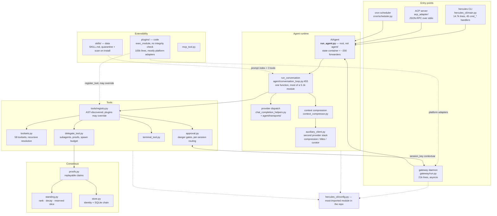

# CLAUDE.md

Orientation for working in this repo. [`AGENTS.md`](./AGENTS.md) covers design
philosophy and the contribution rubric and is still the authority on *what to
build*; this file covers *where things actually are*, and is deliberately
weighted toward the places the layout misleads you.

~500k lines of Python across nine packages. Every claim below was verified
against the source, not inferred from names.

## Architecture

Dotted edges are the ones that violate the obvious layering.

## Five things the layout gets wrong

**`AIAgent` is not in `agent/`.** It is in root `run_agent.py` (5,866 lines).
`agent/` is a *procedural helper library* whose modules take an `agent`
parameter — which is why eight of them carry an identical `def _ra(): import
run_agent` shim. The package depends on the root module defining its own core
type.

**`hercules_cli/` is a dependency of the core, not a shell on top of it.** It
receives ~456 inbound imports from `agent/`, `tools/`, `gateway/` and
`tui_gateway/` — more than it sends out. `hercules_cli/config.py` is the
most-imported module in the repo (206 inbound). The cycle only survives
because 408 of those imports are lazy function-local ones. If you hoist one to
module level, you will create an import cycle.

**Most messaging platforms are not in `gateway/`.** Telegram, Discord, Slack,
Feishu and Matrix live in `plugins/platforms/*/adapter.py`. `gateway/` holds
the daemon, the `BasePlatformAdapter` contract, and a handful of in-tree
adapters. There are *two* discovery mechanisms (a registry and an `if/elif`
chain in `GatewayRunner._create_adapter`) and consequently WhatsApp exists
twice.

**Skills are data; plugins are code.** A skill is a `SKILL.md` on disk, reached
through the prompt index and three registered tools. A plugin is
`exec_module`'d Python that writes into the tool registry. They are not two
flavours of the same thing.

**`hercules mesh` is registered but unreachable** — `build_mesh_parser` is
never called from `main.py`. Verify a subcommand is wired before assuming it
runs.

## Running tests

**Use `scripts/run_tests.sh`, not a bare `pytest tests/…`.** This repo runs
each test file in its own subprocess on purpose. A directory-level pytest run
produces hundreds of cross-test-pollution failures that do not reproduce in
isolation — measured: 225 "failures" in `tests/hercules_cli/`, of which the
sampled ones passed alone.

Optional extras are not installed by default; tests for those integrations
fail locally with `FeatureUnavailable` and pass in CI, which installs
`--extra all --extra dev`. That is not a regression.

2,031 test files, ~723k lines. `tests/gateway/` alone is a quarter of it.

## Security surfaces

- **Approval fails open with no human present.** `tools/approval.py` falls
  through to `return {"approved": True}` when there is no interactive user and
  no gateway session. Gateway sessions are correlated purely by a `session_key`
  contextvar — that identity *is* the whole routing mechanism.
- **Plugin loading has no integrity check.** Any `~/.hercules/plugins/*/__init__.py`
  is `exec_module`'d; the only gate is a config name list. Skills get a far
  stronger path (quarantine → `skills_guard.scan_skill` → policy matrix).
  `register_tool(override=True)` can replace a built-in, and the override gate
  returns `True` unconditionally for anything labelled `bundled` — which
  includes anything dropped into the repo `plugins/` tree.
- `GATEWAY_ALLOW_ALL_USERS` and per-platform equivalents are plain truthy-env
  bypasses of the allowlist.
- Known and unfixed: `bundle_content_hash` in `skills_hub.py` truncates
  SHA-256 to 64 bits while labelled `sha256:`; fetched web/browser content
  reaches exec planning without the untrusted framing `approval.py` applies to
  agent-supplied commands.

## Delegation

`tools/delegate_tool.py` spawns subagents with isolated context. Children have
`clarify` blocked and get automatic approval verdicts — **they can never reach
a human**, and the child prompt says so explicitly.

- `max_child_retries` (1) re-dispatches a crashed or timed-out child on a fresh
  agent. `interrupted` is never retried.
- `max_total_agents` (32) bounds the *whole tree* — `max_spawn_depth` and
  `max_concurrent_children` each bound one level but not their product.
- A task may declare `proof`, a command the parent re-runs; its exit code sets
  the verdict, so `completed` stops meaning "the subagent said so". Prefer it
  over `verify` when success is machine-checkable.
- `route_task_to_model` applies to *delegated* tasks only — nothing in the main
  loop calls it.

Per-child prefill is ~12k tokens, ~96% of it tool schemas. Sibling prompts
diverge at character 77, so prefix caching currently recovers almost nothing.

## Consensus (`agent/consensus/`)

Invariants enforced in code, each mutation-tested — reverting one fails
specific tests:

- A claimant may never verify its own claim.
- Verdicts are *derived* from a replayed observation, never asserted.
- One refutation disqualifies; the proof is deterministic, so majority rule
  would let a bloc carry a demonstrably failing claim.
- Rank buys resources, never truth — `independent_verdicts` takes no standing.
- Position decays; a reserved compute slice ignores rank, because pure
  proportional allocation converges on a monoculture.

`trust.py` is not wired into delegation, deliberately: subagents are ephemeral
and anonymous, so reputation has nothing to attach to.

## Half-finished work — check before extending

- `agent/transports/` is a self-declared partial migration; `get_transport`
  returns `None` and callers fall back to the legacy path.
- `auxiliary_client.py` (6,897 lines) duplicates provider logic already in
  `transports/`, with sync *and* async twins of each adapter.
- Four overlapping compression modules, plus root `trajectory_compressor.py`.
- `agent/curator_backup.py` is a checked-in backup copy.
- God-files: `gateway/run.py` (21k), `hercules_cli/web_server.py` (17k),
  `hercules_cli/main.py` (14.7k).

## Conventions

- Branding is Hercules. Surviving "Hermes" strings are external contracts —
  npm packages (`hermes-parser`), upstream Nous paths (`~/.hermes`,
  `HERMES_HOME`), and `test_brand_identity.py`, which enforces the rename.
  Do not find-replace them.
- Dependencies are exact-pinned with upper bounds; CI enforces both.
- `tools/lazy_deps.py` mirrors `pyproject.toml` extras and must stay in sync —
  a test enforces it.
</content>
