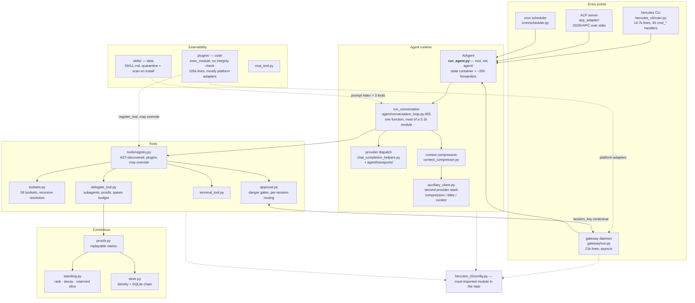

# CLAUDE.md

Orientation for working in this repo. [`AGENTS.md`](./AGENTS.md) covers design
philosophy and the contribution rubric and is still the authority on *what to
build*; this file covers *where things actually are*, and is deliberately
weighted toward the places the layout misleads you.

~500k lines of Python across nine packages. Every claim below was verified
against the source, not inferred from names.

## Commands

Dependencies are managed with `uv` (not pip); Python 3.11 is the CI baseline
(`requires-python = ">=3.11,<3.14"`). Install with extras — most integration
tests are skipped as `FeatureUnavailable` without them:

```bash
uv sync --extra all --extra dev      # full env, as CI installs it
```

- **Run tests:** `scripts/run_tests.sh` — never bare `pytest tests/…` (see
  *Running tests* below for why). Single file: `scripts/run_tests.sh
  tests/agent/test_foo.py`; a subdir: `scripts/run_tests.sh tests/agent/`;
  cap parallelism: `-j 4`; pass through bare pytest flags directly
  (`scripts/run_tests.sh tests/foo.py -k pattern -v`). CI drives it with
  pre-computed slices via `--files`.
- **Lint:** `ruff check .` (CI installs ruff + ty with `uv tool install`).
  Only `PLW1514` is enforced repo-wide — nearly all other ruff rules are
  intentionally off (see `[tool.ruff.lint]` in `pyproject.toml`). CI reports
  ruff/ty findings as a *diff* against the base ref via `scripts/lint_diff.py`
  and does not fail on pre-existing findings.
- **Typecheck:** `ty check` for Python (Astral's `ty`, `--exit-zero` in CI).
  The `typecheck.yml` workflow only typechecks the JS/TS packages (`ui-tui`,
  `web`, `apps/desktop`) via `npm run typecheck`.
- **Build:** `uv build --sdist --wheel`. JS front-ends build with
  `npm ci && npm run build` inside `ui-tui/`, `web/`, and `apps/desktop/`.
- **Run the CLI:** the `hercules` entry point is `hercules_cli.warroom:main`,
  a front door that owns the `warroom`/`tempest`/`obliterate` verbs and
  *delegates every other invocation* to `hercules_cli.main:main`. Other
  console scripts: `hercules-agent` (`run_agent:main`), `hercules-acp`
  (`acp_adapter.entry:main`).
- **Lockfile:** `uv.lock` is CI-enforced in sync with `pyproject.toml`
  (`uv-lockfile-check.yml`); regenerate with `uv lock`, never edit by hand.

## Architecture


```mermaid
graph TB
    subgraph entry["Entry points"]
        CLI["hercules CLI<br/>hercules_cli/main.py<br/>14.7k lines, 45 cmd_* handlers"]
        GW["gateway daemon<br/>gateway/run.py<br/>21k lines, asyncio"]
        ACP["ACP server<br/>acp_adapter/<br/>JSON-RPC over stdio"]
        CRON["cron scheduler<br/>cron/scheduler.py"]
    end

    subgraph core["Agent runtime"]
        AGENT["AIAgent<br/><b>run_agent.py</b> — root, not agent/<br/>state container + ~200 forwarders"]
        LOOP["run_conversation<br/>agent/conversation_loop.py:455<br/>one function, most of a 5.1k module"]
        PROV["provider dispatch<br/>chat_completion_helpers.py<br/>+ agent/transports/"]
        AUX["auxiliary_client.py<br/>second provider stack<br/>compression / titles / curator"]
        CTX["context compression<br/>context_compressor.py"]
    end

    subgraph tools["Tools"]
        REG["tools/registry.py<br/>AST-discovered, plugins may override"]
        TS["toolsets.py<br/>58 toolsets, recursive resolution"]
        DEL["delegate_tool.py<br/>subagents, proofs, spawn budget"]
        APPR["approval.py<br/>danger gates, per-session routing"]
        TERM["terminal_tool.py"]
    end

    subgraph ext["Extensibility"]
        PLUG["plugins/ — code<br/>exec_module, no integrity check<br/>105k lines, mostly platform adapters"]
        SKILL["skills/ — data<br/>SKILL.md, quarantine + scan on install"]
        MCP["mcp_tool.py"]
    end

    subgraph cons["Consensus"]
        PROOF["proofs.py<br/>replayable claims"]
        STAND["standing.py<br/>rank · decay · reserved slice"]
        STORE["store.py<br/>identity + SQLite chain"]
    end

    CLI --> AGENT
    GW --> AGENT
    ACP --> AGENT
    CRON --> AGENT
    AGENT --> LOOP
    LOOP --> PROV
    LOOP --> CTX
    LOOP --> REG
    CTX --> AUX
    REG --> TS
    REG --> DEL
    REG --> APPR
    REG --> TERM
    PLUG -.->|register_tool, may override| REG
    PLUG -.->|platform adapters| GW
    SKILL -.->|prompt index + 3 tools| LOOP
    DEL --> PROOF
    PROOF --> STAND
    PROOF --> STORE
    APPR <-->|session_key contextvar| GW

    CFG["hercules_cli/config.py — most-imported module in the repo"]
    core -.-> CFG
    tools -.-> CFG
    GW -.-> CFG
```

Dotted edges are the ones that violate the obvious layering.

## Five things the layout gets wrong

**`AIAgent` is not in `agent/`.** It is in root `run_agent.py` (5,866 lines).
`agent/` is a *procedural helper library* whose modules take an `agent`
parameter — which is why eight of them carry an identical `def _ra(): import
run_agent` shim. The package depends on the root module defining its own core
type.

**`hercules_cli/` is a dependency of the core, not a shell on top of it.** It
receives ~456 inbound imports from `agent/`, `tools/`, `gateway/` and
`tui_gateway/` — more than it sends out. `hercules_cli/config.py` is the
most-imported module in the repo (206 inbound). The cycle only survives
because 408 of those imports are lazy function-local ones. If you hoist one to
module level, you will create an import cycle.

**Most messaging platforms are not in `gateway/`.** Telegram, Discord, Slack,
Feishu and Matrix live in `plugins/platforms/*/adapter.py`. `gateway/` holds
the daemon, the `BasePlatformAdapter` contract, and a handful of in-tree
adapters. There are *two* discovery mechanisms (a registry and an `if/elif`
chain in `GatewayRunner._create_adapter`) and consequently WhatsApp exists
twice.

**Skills are data; plugins are code.** A skill is a `SKILL.md` on disk, reached
through the prompt index and three registered tools. A plugin is
`exec_module`'d Python that writes into the tool registry. They are not two
flavours of the same thing.

**`hercules mesh` is registered but unreachable** — `build_mesh_parser` is
never called from `main.py`. Verify a subcommand is wired before assuming it
runs.

## Running tests

**Use `scripts/run_tests.sh`, not a bare `pytest tests/…`.** This repo runs
each test file in its own subprocess on purpose. A directory-level pytest run
produces hundreds of cross-test-pollution failures that do not reproduce in
isolation — measured: 225 "failures" in `tests/hercules_cli/`, of which the
sampled ones passed alone.

Optional extras are not installed by default; tests for those integrations
fail locally with `FeatureUnavailable` and pass in CI, which installs
`--extra all --extra dev`. That is not a regression.

2,031 test files, ~723k lines. `tests/gateway/` alone is a quarter of it.

## Security surfaces

- **Approval fails open with no human present.** `tools/approval.py` falls
  through to `return {"approved": True}` when there is no interactive user and
  no gateway session. Gateway sessions are correlated purely by a `session_key`
  contextvar — that identity *is* the whole routing mechanism.
- **Plugin loading has no integrity check.** Any `~/.hercules/plugins/*/__init__.py`
  is `exec_module`'d; the only gate is a config name list. Skills get a far
  stronger path (quarantine → `skills_guard.scan_skill` → policy matrix).
  `register_tool(override=True)` can replace a built-in, and the override gate
  returns `True` unconditionally for anything labelled `bundled` — which
  includes anything dropped into the repo `plugins/` tree.
- `GATEWAY_ALLOW_ALL_USERS` and per-platform equivalents are plain truthy-env
  bypasses of the allowlist.
- Skill content hashes are the full SHA-256. They used to be truncated to 64
  bits while still labelled `sha256:`. Compare recorded hashes with
  `skills_guard.content_hashes_match`, never `==` — locks written before the
  widening still hold the 16-hex form and are accepted as a prefix.
- Known and unfixed: fetched web/browser content reaches exec planning without
  the untrusted framing `approval.py` applies to agent-supplied commands.

## Delegation

`tools/delegate_tool.py` spawns subagents with isolated context. Children have
`clarify` blocked and get automatic approval verdicts — **they can never reach
a human**, and the child prompt says so explicitly.

- `max_child_retries` (1) re-dispatches a crashed or timed-out child on a fresh
  agent. `interrupted` is never retried.
- `max_total_agents` (32) bounds the *whole tree* — `max_spawn_depth` and
  `max_concurrent_children` each bound one level but not their product.
- A task may declare `proof`, a command the parent re-runs; its exit code sets
  the verdict, so `completed` stops meaning "the subagent said so". Prefer it
  over `verify` when success is machine-checkable.
- `route_task_to_model` applies to *delegated* tasks only — nothing in the main
  loop calls it.

Per-child prefill is ~12k tokens, ~96% of it tool schemas. Sibling prompts
diverge at character 77, so prefix caching currently recovers almost nothing.

## Consensus (`agent/consensus/`)

Invariants enforced in code, each mutation-tested — reverting one fails
specific tests:

- A claimant may never verify its own claim.
- Verdicts are *derived* from a replayed observation, never asserted.
- One refutation disqualifies; the proof is deterministic, so majority rule
  would let a bloc carry a demonstrably failing claim.
- Rank buys resources, never truth — `independent_verdicts` takes no standing.
- Position decays; a reserved compute slice ignores rank, because pure
  proportional allocation converges on a monoculture.

`trust.py` is not wired into delegation, deliberately: subagents are ephemeral
and anonymous, so reputation has nothing to attach to.

## Half-finished work — check before extending

- `agent/transports/` is a self-declared partial migration; `get_transport`
  returns `None` and callers fall back to the legacy path.
- `auxiliary_client.py` (6,897 lines) duplicates provider logic already in
  `transports/`, with sync *and* async twins of each adapter.
- Four overlapping compression modules, plus root `trajectory_compressor.py`.
- `agent/curator_backup.py` is a checked-in backup copy.
- God-files: `gateway/run.py` (21k), `hercules_cli/web_server.py` (17k),
  `hercules_cli/main.py` (14.7k).

## End-to-End Request Flow: Skills and Tools

This section maps what happens when a user sends a message like `skills`, `tools`, `skill view`, or `/skill-name`. The flow spans three layers: **discovery** (what the system knows about), **instrumentation** (what the model sees), and **execution** (how the model invokes).

### The Architecture Path: How Skills Reach the Model

```
User input ("skills" | "skill view" | "tools" | "/skill-name")
    ↓
[CLI/Gateway entry point]  (cli.py / gateway/run.py)
    ↓
[AIAgent.__init__]  (run_agent.py:1200+)
    ├─→ Lazy tool registry discovery (tools/registry.py + plugins)
    ├─→ Toolset resolution (toolsets.py)
    └─→ System prompt assembly (agent/system_prompt.py:147)
    ↓
[build_system_prompt]  (agent/system_prompt.py:515)
    ├─→ Stable tier: SOUL.md + DEFAULT_AGENT_IDENTITY + operational guidance
    ├─→ build_skills_system_prompt() — **skills index lives here**
    │   └─→ Scans ~/.hercules/skills/ via skills_tool.SKILLS_DIR
    │   └─→ Parses SKILL.md frontmatter (name, description, tags, platforms)
    │   └─→ Renders as markdown index: "- skill-name: one-line description"
    │   └─→ Conditional compact mode (focus-mode demotes categories)
    ├─→ Stable tier: tool guidance, computer-use, enforcement, environment hints
    ├─→ Context tier: AGENTS.md, .cursorrules, caller-supplied system_message
    └─→ Volatile tier: memory, USER.md, external memory, timestamp
    ↓
[System prompt now contains]:
    - Skill index (names + descriptions)
    - Tool definitions (JSON schema for skills_list, skill_view, skill_manage, etc.)
    - Behavioral guidance (skill usage, tool call discipline, task completion)
    ↓
[Model sees]:
    - skill-name: one-line description
    - ... 50+ more skills
    - [Tool definitions for: skills_list, skill_view, skill_manage, terminal, ...]
```

### Three Tool Handles for Skills (tools/skills_tool.py)

When the model wants to interact with skills, it has three registered tools:

1. **`skills_list(query="")`** — Search/list installed skills
   - Returns: `{name, description, tags, size, installed_at, last_used, category}`
   - Used by: agent + gateway UI for discovery

2. **`skill_view(name, file_path="")`** — Read skill content or supporting files
   - Loads SKILL.md frontmatter, body, linked files, setup instructions
   - Returns: `{success, name, content, raw_content, path, skill_dir, setup_note, ...}`
   - Used by: agent before invoking a skill, to see full body + supporting files

3. **`skill_manage(action, name, ...)`** — Install/remove/enable/disable/reload
   - Actions: `"install"`, `"remove"`, `"enable"`, `"disable"`, `"reload"`
   - Returns: `{success, message, added/removed/changed}`
   - Used by: user workflow, curator, skill lifecycle events

### How the Model Invokes a Skill (agent/skill_commands.py)

When the model decides to use a skill, it takes one of two paths:

**Path A: Tool-based invocation** (e.g. terminal, web_search)
```
Model call: skill_view(name="web-search")
    ↓
[skill_commands._load_skill_payload]  (line 138)
    ├─→ Normalize skill name (web-search → web-search)
    ├─→ Call skill_view(normalized_name) → JSON response
    ├─→ Load {success, content, path, skill_dir, setup_note, ...}
    ├─→ Track usage via skill_usage.bump_use() — for curator
    └─→ Return loaded_skill dict + skill_dir + display_name
    ↓
[Model embeds result in conversation]
```

**Path B: Slash-command invocation** (e.g. `/claude-code do XYZ`)
```
User input: "/web-search fetch the latest AI news"
    ↓
[cli.py / gateway slash-command parser]
    ├─→ detect_slash_command("web-search")
    ├─→ get_skill_commands() — cached mapping "/command" → {name, description, path}
    ├─→ resolve_skill_command_key("web-search") → "/web-search"
    └─→ Extract remaining text: "fetch the latest AI news"
    ↓
[build_skill_invocation_message]  (skill_commands.py:489)
    ├─→ _load_skill_payload(skill_dir)
    ├─→ _build_skill_message(loaded_skill, skill_dir, activation_note)
    │   ├─→ Template variable expansion ({{ }} syntax)
    │   ├─→ Inline shell execution (if enabled in skills.yml config)
    │   ├─→ Inject skill directory path
    │   ├─→ Inject resolved config values (from config.yaml)
    │   ├─→ List supporting files (references/, templates/, scripts/, assets/)
    │   └─→ Build header: "[IMPORTANT: The user has invoked the \"skill-name\" skill...]"
    └─→ Append user instruction: "fetch the latest AI news"
    ↓
[Model receives expanded message]:
    "[IMPORTANT: The user has invoked the \"web-search\" skill...]
    [Full skill content here: markdown, bash, python, etc.]
    [Skill directory: /home/user/.hercules/skills/web-search]
    [Supporting files: ...]
    The user has provided the following instruction: fetch the latest AI news"
    ↓
Model now executes the skill with context + user intent
```

### Stacked Invocation (Multiple Skills at Once)

```
User input: "/claude-code /web-search do refactor my code and search"
    ↓
[split_stacked_skill_commands]  (line 553)
    ├─→ Consume leading /skill tokens (up to 5 skills max)
    ├─→ Stop at first non-skill token ("do")
    └─→ Return: (["/claude-code", "/web-search"], "do refactor my code and search")
    ↓
[build_stacked_skill_invocation_message]  (line 585)
    ├─→ Load each skill independently
    ├─→ Build "skill bundle" header + "[Loaded as part of the stacked skill bundle]"
    ├─→ Append skill blocks (activation note + content for each)
    ├─→ Append user instruction once at the end
    ↓
Model receives all loaded skills + unified instruction
```

### How the Agent Knows What to Do (agent/system_prompt.py)

The model's instructions come from **three sources** (build_system_prompt_parts):

1. **Stable tier** (built once, never rebuilt)
   - SOUL.md (from docker/SOUL.md) — Hercules identity + philosophy
   - Skill index — names + descriptions of every installed skill
   - Tool guidance — how to use memory, session_search, skills_list/view/manage
   - Task completion guidance — "never stop at a stub, no fabrication"
   - Parallel tool call guidance — batch independent calls
   - Ferrox optimization discipline — continuous performance improvement
   - Astra reasoning — GPT-6 principles (verification, adversarial thinking)
   - Computer-use guidance (if computer_use tool is loaded)
   - Tool-use enforcement — tells the model to call tools, not describe them
   - Model-specific operational guidance (Gemini, GPT, etc. have different quirks)
   - Coding context (git status, dependencies, file structure)
   - Active profile reminder (default vs. named profiles)
   - Platform hints (CLI, TUI, Gateway, Discord, Slack — each gets platform-specific wording)

2. **Context tier** (session-stable, may change between sessions)
   - AGENTS.md (if present in working directory)
   - .cursorrules (per-project Claude Code rules)
   - Other context files under TERMINAL_CWD
   - Caller-supplied system_message

3. **Volatile tier** (never cached, changes every session)
   - MEMORY.md (user's learned patterns, previous solutions, working notes)
   - USER.md (user profile, preferences, constraints)
   - External memory provider block (e.g. Mem0, Honcho — if enabled)
   - Timestamp: "Conversation started: Tuesday, February 25, 2025"
   - Session ID, Model, Provider

**Key insight**: The skill index is in the **stable** tier, so it's cached with the session. When the user runs `/reload-skills`, it re-scans and repopulates the cache *without invalidating the prompt cache* — the session keeps its prefix cache hit and pays no cost.

### Request Routing: How "skills" Gets Resolved

When a user types "skills" (the literal word, not a slash command):

```
User input: "skills"
    ↓
[run_conversation]  (agent/conversation_loop.py:455)
    ├─→ Pass to provider (Anthropic, OpenAI, etc.)
    ├─→ Model sees: tool_list = [skills_list, skill_view, skill_manage, ...]
    └─→ Model generates: tool_call("skills_list", query="")
    ↓
[handle_tool_call]  (run_agent.py / agent/conversation_loop.py)
    ├─→ Dispatch to tools/skills_tool.skills_list()
    ├─→ Scan ~/.hercules/skills/ + config.skills.external_dirs
    ├─→ Filter by platform (skills.platform_disabled) + environment (kanban/docker/s6)
    ├─→ Sort by usage (curator lifecycle), return JSON
    ↓
[Model receives]:
    [{name: "web-search", description: "...", tags: [...], last_used: "2025-02-25", ...},
     {name: "claude-code", description: "...", ...},
     ...]
    ↓
Model synthesizes + returns to user: "Here are your installed skills..."
```

When a user types "skill view web-search":

```
User input: "skill view web-search"
    ↓
[Model generates]: tool_call("skill_view", name="web-search")
    ↓
[skill_view()]  (tools/skills_tool.py)
    ├─→ Find SKILL.md in ~/.hercules/skills/web-search/ or external dir
    ├─→ Parse frontmatter (name, description, metadata)
    ├─→ Load full body (markdown/code)
    ├─→ Check setup status (required env, dependencies)
    ├─→ Collect linked files + supporting files
    ├─→ Return: {success: true, name, content, raw_content, setup_note, skill_dir, ...}
    ↓
[Model receives full skill in context]
Model now understands what the skill does + how to invoke it
```

### Key Files to Know

| File | Lines | Purpose |
|------|-------|---------|
| `agent/system_prompt.py:147` | 400 | Assembles 3-tier system prompt (stable/context/volatile) |
| `agent/prompt_builder.py` | 2000+ | Hardcoded guidance blocks (SOUL, tool guidance, operational) |
| `agent/skill_commands.py` | 730 | Slash-command parsing + skill expansion (`/skill-name args`) |
| `tools/skills_tool.py` | 300+ | Three tool implementations (skills_list, skill_view, skill_manage) |
| `agent/conversation_loop.py:455` | 5.1k module | Main agent loop — calls provider + handles tool dispatch |
| `run_agent.py:1200+` | 5.8k | AIAgent.__init__ — builds registry, system prompt, starts loop |
| `tools/registry.py` | 300+ | Discovers + registers tools (AST-based discovery + plugins) |
| `toolsets.py` | 1000+ | Resolves toolset membership + recursive tool selection |
| `docker/SOUL.md` | 150+ | Agent identity + philosophy (LOADED as stable tier #1) |

### The Prompt Cache Contract

**Never mutate or rebuild the system prompt mid-conversation.** The entire prompt is cached under a single prefix hash. Changes that break the prompt break the cache:

- ✅ Loading a new skill via `/reload-skills` — rescan done *after* prompt cache is built
- ❌ Rebuilding the skill index mid-turn — would invalidate the cached stable tier
- ✅ Compression events *are allowed* to rebuild (context_compressor.py invalidates explicitly)
- ❌ Changing agent config (model, platform, SOUL.md) mid-session — breaks the cache

The cost of a cache miss is ~50–200% token inflation; avoid it.

## Conventions

- Branding is Hercules. Surviving "Hermes" strings are external contracts —
  npm packages (`hermes-parser`), upstream Nous paths (`~/.hermes`,
  `HERMES_HOME`), and `test_brand_identity.py`, which enforces the rename.
  Do not find-replace them.
- Dependencies are exact-pinned with upper bounds; CI enforces both.
- `tools/lazy_deps.py` mirrors `pyproject.toml` extras and must stay in sync —
  a test enforces it.
</content>
