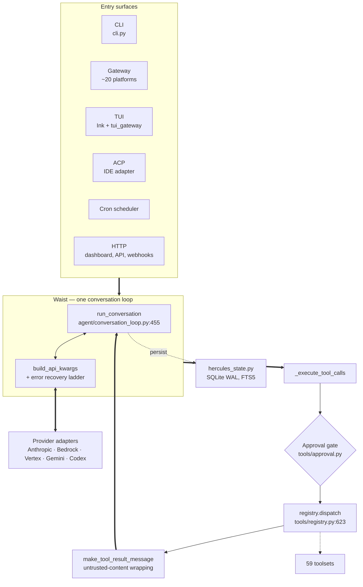
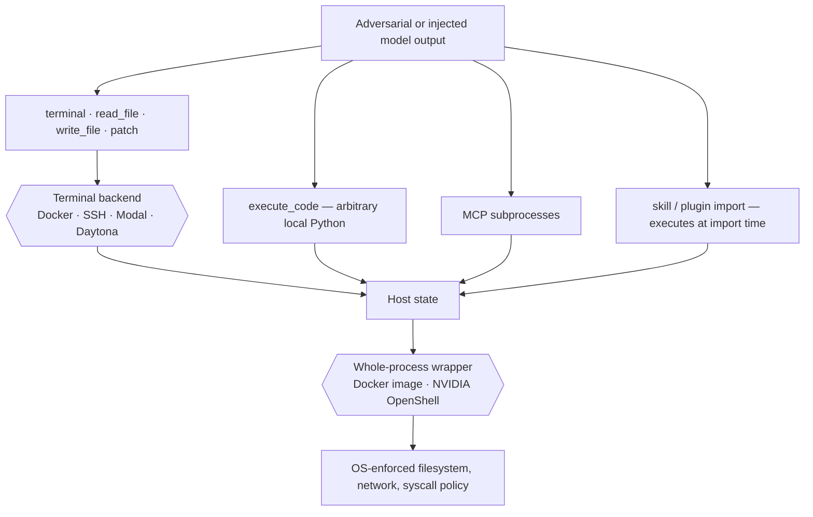
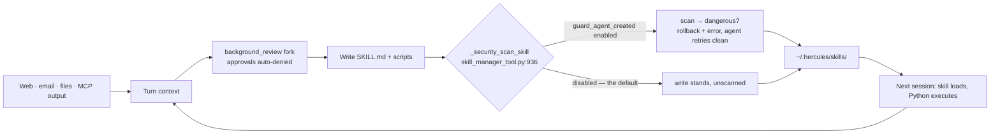

# Architecture and trust survey

**Scope:** static reading of the working tree at `2882a06`. Nothing was executed;
no runtime behaviour was changed by this survey.

**Purpose:** a structural map of the runtime, a trust-boundary assessment, and a
ranked recommendation ledger that separates changes worth making from changes
that would trade a real property for an apparent one.

---

## 1. Summary

The highest-value security change available in this tree is not new machinery.
`_security_scan_skill` already scans every skill the agent writes for itself and
rolls the directory back on a block — but it returns early unless
`skills.guard_agent_created` is set, which defaults to false. Enabling it by
default closes the injection-to-persistence path described in §4 without adding
code, without a human prompt, and without interrupting the autonomous learning
loop.

More generally: the risk in this codebase concentrates in capability that is
built and tested but switched off, not in capability that is missing.

### Measurements

| Metric | Value |
| --- | --- |
| Python lines (incl. tests) | ~1.37M |
| Test lines / files | ~724K across 2,014 files |
| CI workflows | 19 |
| Toolsets | 59 |
| Gateway platform adapters | ~20 |
| Largest module | `gateway/run.py`, 21,059 lines |
| Ruff rules enabled | 1 (`PLW1514`) |
| Env vars in `.env.example` | 122, of which 37 are credentials |

---

## 2. Control flow

Every surface converges on one function. `run_conversation`
(`agent/conversation_loop.py:455`) is roughly 4,700 lines and owns the loop,
tool dispatch, and the provider error-recovery ladder.

This is deliberate. `AGENTS.md` states the invariant as a *narrow waist*: every
model tool ships on every API call, so a new core tool is the expensive
exception and capability belongs at the edges as skills, plugins, and MCP
servers.

The approval gate sits *inside* the process, between model output and tool
handler. That placement is why `SECURITY.md` declines to call it a boundary.

---

## 3. Trust boundaries

`SECURITY.md:58` states the model plainly: **the only security boundary against
an adversarial LLM is the operating system.** The practical consequence is that
terminal-backend isolation — the posture most operators reach for — confines
less than it appears to.

Three of the four sinks bypass the terminal backend. Only whole-process
wrapping covers all four, and it is not the default. This is documented
accurately rather than papered over, which is the right posture — the note here
is that the gap between the two isolation modes is easy for an operator to
misjudge.

---

## 4. The self-improvement loop

After a turn, a forked review agent writes memory entries and authors skills
into `~/.hercules/skills/`. Skills carry executable Python that runs at import
on the next session. The fork's context may contain content fetched from the
open web, so this is a write path from untrusted input to code execution.

The guards are thoughtful: the review fork auto-denies every approval request it
generates (`agent/background_review.py:637`), its tools are whitelisted to
memory and skill management, and provenance tagging keeps the curator from
pruning user-authored skills.

The install policy for the `agent-created` source is
`(safe → allow, caution → allow, dangerous → ask)`, and "ask" surfaces to the
agent as an error it can retry around rather than as a prompt to the human. Two
of three severity tiers pass through untouched, so the false-positive cost of
enabling this is close to zero.

---

## 5. Findings

Ranked by what to address first. Every anchor below was verified by opening the
cited source.

### 5.1 Agent-created skill scanner is disabled by default

`tools/skill_manager_tool.py:121,936` · `tools/skills_guard.py:55-65`

The scan-and-rollback path is fully implemented and covered by tests, then gated
behind a flag defaulting to false. See §4 for why enabling it is low-cost.

### 5.2 MCP catalog install runs unreviewed shell from a mutable ref

`hercules_cli/mcp_catalog.py:359-419`

`_do_git_install` clones at a branch or tag — mutable, so an upstream
force-push changes what is installed on the next re-install, and the function
wipes and re-clones each time. It then passes every manifest `bootstrap` string
to `subprocess.run(cmd, shell=True)` with no allowlist and no confirmation.

The bundled catalog is protected by process: `supply-chain-audit.yml:228`
requires an `mcp-catalog-reviewed` label on any PR touching `optional-mcps/`.
That protection does not extend to the install path itself. SHA refs are already
handled by the code, as a fallback — making them the requirement is additive.

### 5.3 No cryptographic verification in the skill or MCP install path

`tools/skills_hub.py:294` · `tools/skills_guard.py:44-53,705`

Trust rests on an SSRF guard, a heuristic content scan, and operator review.
`hashlib` use in the hub is cache keys and change detection, not integrity.

The precedent for a fix is in-tree: `NVIDIA/skills` is trusted specifically
because each entry ships a signed `skill.oms.sig` and the sync pipeline drops
anything missing it. Generalizing that from one hardcoded repo to a verifiable
property adds a boundary rather than another heuristic.

### 5.4 `execute_code` auto-approves in local non-interactive runs

`tools/approval.py:3015-3047`

In a headless local session that is neither gateway nor `HERCULES_EXEC_ASK`, the
gate returns approved with no prompt. Structurally, once `execute_code` runs at
all, the script can call `os.system` or `ctypes` directly and no shell-string
pattern ever sees it — the cron denial message in the same function says exactly
this. The cron path defaults to deny for precisely this reason; the local
non-interactive path is the same absent-human situation.

### 5.5 YOLO is reachable from chat, and slash gating is off by default

`tools/approval.py:3015` · `gateway/slash_access.py` · `SECURITY.md` §2.6

`/yolo` disables all 47 dangerous patterns, leaving the 12 hardline ones. It is
invocable from the gateway, and `slash_access` gating is disabled entirely when
`allow_admin_from` is unset — the shipped default. The allowlist separates
strangers from users; it does not separate "may chat" from "may disarm the gate."

Gating state-changing slash commands is narrower than per-caller capabilities
and does not reopen the policy's deliberate rejection of the latter.

### 5.6 Untrusted-content wrapping covers the web but not the filesystem

`agent/tool_dispatch_helpers.py:413-423`

Wrapping applies to `web_search`, `web_extract`, and the `browser_` / `mcp_`
prefixes. A poisoned `AGENTS.md` in a cloned repository arrives unwrapped, as do
email, messaging, and session-search results.

Blanket wrapping is not the answer — see §6.

### 5.7 Static analysis is switched off across the tree

`pyproject.toml` `[tool.ruff.lint]` · `.github/workflows/lint.yml`

Ruff selects one rule. Type checking uses `ty` 0.0.21, advisory-only in CI; no
mypy, no pyright. ESLint configs and vitest suites exist in three TypeScript
packages and are invoked by no workflow.

This contrasts sharply with the project's dependency hygiene, where every direct
dependency is exact-pinned as documented supply-chain hardening. External code
is currently held to a higher standard than the project's own.

---

## 6. Recommendation ledger

### Move forward

| Change | Why it is safe |
| --- | --- |
| Default `skills.guard_agent_created` to on | Machinery exists and is tested; no human prompt; only dangerous findings block |
| Require SHA refs for MCP git installs; echo bootstrap for confirmation | SHA handling already implemented — this promotes it from fallback to requirement |
| Wire ESLint and vitest into CI | Both configured in three packages, run by nothing. No new tooling |
| Ratchet ruff one rule family at a time, per directory | Correctness families first on `agent/` and `tools/`; keeps each diff reviewable |
| Generalize signature verification from the NVIDIA special case | Adds a boundary rather than a heuristic |
| Align local non-interactive `execute_code` with the cron path | Same absent-human situation; cron already reasons about it correctly |
| Reconcile `AGENTS.md` figures with the tree | It is the contributor constitution; its size figures have drifted |

### Hold — these would move backwards

**Do not default `write_approval` to on.** It would put a human prompt in front
of every memory and skill write, breaking the autonomous learning loop that is
the product's differentiator. §5.1 closes most of the same gap without touching
the UX.

**Do not expand the dangerous-command denylist as hardening.** Shell is
Turing-complete and `SECURITY.md:140` correctly classifies the gate as accident
prevention. A longer list buys false assurance for marginal coverage.

**Do not blanket-wrap every tool result as untrusted.** Token cost lands on the
hottest path, and a marker that appears everywhere stops carrying information.
Scope it to reads outside the trusted workspace.

**Do not start splitting the 14k+ line modules yet.** One commit of history, one
enabled lint rule, and an advisory pre-1.0 type checker is not enough net for a
refactor of that size. Land the static analysis first; then the extraction
`AGENTS.md` asks for becomes safe rather than brave.

**Do not add per-caller capabilities to the gateway.** `SECURITY.md` §2.6
deliberately rejects this in favour of separate instances with separate
allowlists.

---

## 7. Notes on repository history

The tree presents as a single squashed commit, but the record survives in the
code itself. Comments cite five-digit issue numbers at fix sites — fail-open
authorization (#23778, #34515), approval persistence (#39275), context
propagation (#33057) — implying tens of thousands of upstream tickets. The
authorization code explains not just what it does but which fail-open bug taught
it to.

The OpenClaw lineage is cleanly quarantined into an `openclaw-migration` skill
and a `hercules claw migrate` command rather than smeared through the tree as
dead compatibility shims. `docs/branch-provenance.md` already documents the
unrelated-history side branches.

Two claims examined during this survey did **not** survive verification and are
recorded here so they are not re-derived: agent-authored skills *are* passed to
the scanner (the flag, not the wiring, is the gap), and bundled MCP catalog
changes *are* gated by a required CI review label.
